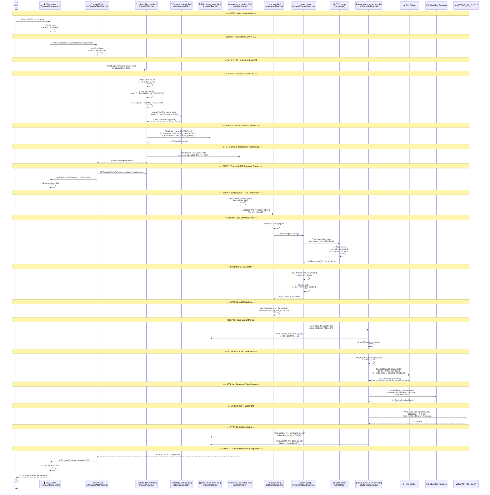

# Open WebUI — Complete API Routes Diagram

```mermaid
graph LR
    APP["🌐 Open WebUI<br/>FastAPI App"]

    %% ===== WebSocket =====
    WS["/ws<br/>WebSocket"]
    APP --> WS

    %% ===== Ollama =====
    OLLAMA["/ollama"]
    APP --> OLLAMA
    OLLAMA --> OLLAMA_1["HEAD /"]
    OLLAMA --> OLLAMA_2["GET /"]
    OLLAMA --> OLLAMA_3["POST /verify"]
    OLLAMA --> OLLAMA_4["GET /config"]
    OLLAMA --> OLLAMA_5["POST /config/update"]
    OLLAMA --> OLLAMA_6["GET /api/tags"]
    OLLAMA --> OLLAMA_7["GET /api/tags/{url_idx}"]
    OLLAMA --> OLLAMA_8["GET /api/ps"]
    OLLAMA --> OLLAMA_9["GET /api/version"]
    OLLAMA --> OLLAMA_10["GET /api/version/{url_idx}"]
    OLLAMA --> OLLAMA_11["POST /api/unload"]
    OLLAMA --> OLLAMA_12["POST /api/pull"]
    OLLAMA --> OLLAMA_13["POST /api/pull/{url_idx}"]
    OLLAMA --> OLLAMA_14["DELETE /api/push"]
    OLLAMA --> OLLAMA_15["DELETE /api/push/{url_idx}"]
    OLLAMA --> OLLAMA_16["POST /api/create"]
    OLLAMA --> OLLAMA_17["POST /api/create/{url_idx}"]
    OLLAMA --> OLLAMA_18["POST /api/copy"]
    OLLAMA --> OLLAMA_19["POST /api/copy/{url_idx}"]
    OLLAMA --> OLLAMA_20["DELETE /api/delete"]
    OLLAMA --> OLLAMA_21["DELETE /api/delete/{url_idx}"]
    OLLAMA --> OLLAMA_22["POST /api/show"]

    %% ===== OpenAI =====
    OPENAI["/openai"]
    APP --> OPENAI
    OPENAI --> OPENAI_1["GET /config"]
    OPENAI --> OPENAI_2["POST /config/update"]
    OPENAI --> OPENAI_3["POST /audio/speech"]
    OPENAI --> OPENAI_4["GET /models"]
    OPENAI --> OPENAI_5["GET /models/{url_idx}"]
    OPENAI --> OPENAI_6["POST /verify"]
    OPENAI --> OPENAI_7["POST /chat/completions"]

    %% ===== Pipelines =====
    PIPELINES["/api/v1/pipelines"]
    APP --> PIPELINES
    PIPELINES --> PIPE_1["GET /list"]
    PIPELINES --> PIPE_2["POST /upload"]
    PIPELINES --> PIPE_3["POST /add"]
    PIPELINES --> PIPE_4["DELETE /delete"]
    PIPELINES --> PIPE_5["GET /"]
    PIPELINES --> PIPE_6["GET /{pipeline_id}/valves"]
    PIPELINES --> PIPE_7["GET /{pipeline_id}/valves/spec"]
    PIPELINES --> PIPE_8["POST /{pipeline_id}/valves/update"]

    %% ===== Tasks =====
    TASKS["/api/v1/tasks"]
    APP --> TASKS
    TASKS --> TASK_1["POST /active/chats"]
    TASKS --> TASK_2["GET /config"]
    TASKS --> TASK_3["POST /config/update"]
    TASKS --> TASK_4["POST /title/completions"]
    TASKS --> TASK_5["POST /follow_up/completions"]
    TASKS --> TASK_6["POST /tags/completions"]
    TASKS --> TASK_7["POST /image_prompt/completions"]
    TASKS --> TASK_8["POST /queries/completions"]
    TASKS --> TASK_9["POST /auto/completions"]
    TASKS --> TASK_10["POST /emoji/completions"]
    TASKS --> TASK_11["POST /moa/completions"]

    %% ===== Images =====
    IMAGES["/api/v1/images"]
    APP --> IMAGES
    IMAGES --> IMG_1["GET /config"]
    IMAGES --> IMG_2["POST /config/update"]
    IMAGES --> IMG_3["GET /config/url/verify"]
    IMAGES --> IMG_4["GET /models"]
    IMAGES --> IMG_5["POST /generations"]
    IMAGES --> IMG_6["POST /edit"]

    %% ===== Audio =====
    AUDIO["/api/v1/audio"]
    APP --> AUDIO
    AUDIO --> AUD_1["GET /config"]
    AUDIO --> AUD_2["POST /config/update"]
    AUDIO --> AUD_3["POST /speech"]

    %% ===== Retrieval =====
    RETRIEVAL["/api/v1/retrieval"]
    APP --> RETRIEVAL
    RETRIEVAL --> RET_1["GET /"]
    RETRIEVAL --> RET_2["GET /embedding"]
    RETRIEVAL --> RET_3["POST /embedding/update"]
    RETRIEVAL --> RET_4["GET /config"]
    RETRIEVAL --> RET_5["POST /config/update"]
    RETRIEVAL --> RET_6["GET /config/{key}"]
    RETRIEVAL --> RET_7["POST /file"]
    RETRIEVAL --> RET_8["POST /query"]
    RETRIEVAL --> RET_9["POST /web/search"]
    RETRIEVAL --> RET_10["GET /link"]
    RETRIEVAL --> RET_11["POST /update/{id}"]
    RETRIEVAL --> RET_12["POST /reset"]
    RETRIEVAL --> RET_13["POST /chunk/{id}"]

    %% ===== Configs =====
    CONFIGS["/api/v1/configs"]
    APP --> CONFIGS
    CONFIGS --> CFG_1["POST /import"]
    CONFIGS --> CFG_2["GET /export"]
    CONFIGS --> CFG_3["GET /connections"]
    CONFIGS --> CFG_4["POST /connections"]
    CONFIGS --> CFG_5["POST /oauth/clients/register"]
    CONFIGS --> CFG_6["GET /tool_servers"]
    CONFIGS --> CFG_7["POST /tool_servers"]
    CONFIGS --> CFG_8["POST /tool_servers/verify"]
    CONFIGS --> CFG_9["GET /code_execution"]
    CONFIGS --> CFG_10["POST /code_execution"]
    CONFIGS --> CFG_11["GET /models"]
    CONFIGS --> CFG_12["POST /models"]
    CONFIGS --> CFG_13["GET /ban_mids"]
    CONFIGS --> CFG_14["POST /ban_mids"]

    %% ===== Auths =====
    AUTHS["/api/v1/auths"]
    APP --> AUTHS
    AUTHS --> AUTH_1["GET /"]
    AUTHS --> AUTH_2["POST /update/profile"]
    AUTHS --> AUTH_3["POST /update/timezone"]
    AUTHS --> AUTH_4["POST /update/password"]
    AUTHS --> AUTH_5["POST /ldap"]
    AUTHS --> AUTH_6["POST /signin"]
    AUTHS --> AUTH_7["POST /signup"]
    AUTHS --> AUTH_8["POST /signout"]
    AUTHS --> AUTH_9["POST /token/exchange"]

    %% ===== Users =====
    USERS["/api/v1/users"]
    APP --> USERS
    USERS --> USR_1["GET /"]
    USERS --> USR_2["GET /all"]
    USERS --> USR_3["GET /search"]
    USERS --> USR_4["GET /groups"]
    USERS --> USR_5["GET /permissions"]
    USERS --> USR_6["GET /default/permissions"]
    USERS --> USR_7["POST /default/permissions"]
    USERS --> USR_8["GET /user/settings"]
    USERS --> USR_9["POST /user/settings/update"]
    USERS --> USR_10["GET /user/status"]
    USERS --> USR_11["POST /user/status/update"]
    USERS --> USR_12["GET /user/info"]
    USERS --> USR_13["POST /user/info/update"]
    USERS --> USR_14["GET /{user_id}"]
    USERS --> USR_15["GET /{user_id}/info"]
    USERS --> USR_16["GET /{user_id}/oauth/sessions"]
    USERS --> USR_17["GET /{user_id}/profile/image"]
    USERS --> USR_18["GET /{user_id}/active"]
    USERS --> USR_19["POST /{user_id}/update"]
    USERS --> USR_20["DELETE /{user_id}"]
    USERS --> USR_21["GET /{user_id}/groups"]

    %% ===== Channels =====
    CHANNELS["/api/v1/channels"]
    APP --> CHANNELS
    CHANNELS --> CH_1["GET /"]
    CHANNELS --> CH_2["GET /list"]
    CHANNELS --> CH_3["GET /users/{user_id}"]
    CHANNELS --> CH_4["POST /create"]
    CHANNELS --> CH_5["GET /{id}"]
    CHANNELS --> CH_6["POST /{id}/update"]
    CHANNELS --> CH_7["DELETE /{id}/delete"]
    CHANNELS --> CH_8["POST /{id}/users/add"]
    CHANNELS --> CH_9["POST /{id}/users/remove"]
    CHANNELS --> CH_10["GET /{id}/messages"]
    CHANNELS --> CH_11["POST /{id}/messages"]
    CHANNELS --> CH_12["DELETE /{id}/messages/{message_id}"]

    %% ===== Chats =====
    CHATS["/api/v1/chats"]
    APP --> CHATS
    CHATS --> CHAT_1["GET /"]
    CHATS --> CHAT_2["GET /list"]
    CHATS --> CHAT_3["POST /create"]
    CHATS --> CHAT_4["GET /{id}"]
    CHATS --> CHAT_5["POST /{id}/update"]
    CHATS --> CHAT_6["DELETE /{id}"]
    CHATS --> CHAT_7["GET /stats/usage"]
    CHATS --> CHAT_8["GET /stats/export"]
    CHATS --> CHAT_9["GET /stats/export/{chat_id}"]
    CHATS --> CHAT_10["POST /{chat_id}/share"]
    CHATS --> CHAT_11["GET /{chat_id}/share/{share_id}"]

    %% ===== Notes =====
    NOTES["/api/v1/notes"]
    APP --> NOTES
    NOTES --> NOTE_1["GET /"]
    NOTES --> NOTE_2["GET /search"]
    NOTES --> NOTE_3["POST /create"]
    NOTES --> NOTE_4["GET /{id}"]
    NOTES --> NOTE_5["POST /{id}/update"]
    NOTES --> NOTE_6["POST /{id}/access/update"]
    NOTES --> NOTE_7["DELETE /{id}/delete"]

    %% ===== Models =====
    MODELS["/api/v1/models"]
    APP --> MODELS
    MODELS --> MOD_1["GET /list"]
    MODELS --> MOD_2["GET /base"]
    MODELS --> MOD_3["GET /tags"]
    MODELS --> MOD_4["POST /create"]
    MODELS --> MOD_5["GET /export"]
    MODELS --> MOD_6["POST /import"]
    MODELS --> MOD_7["POST /sync"]
    MODELS --> MOD_8["GET /model"]
    MODELS --> MOD_9["GET /model/profile/image"]
    MODELS --> MOD_10["POST /model/toggle"]
    MODELS --> MOD_11["POST /model/update"]
    MODELS --> MOD_12["POST /model/access/update"]
    MODELS --> MOD_13["POST /model/delete"]
    MODELS --> MOD_14["DELETE /delete/all"]

    %% ===== Knowledge =====
    KNOWLEDGE["/api/v1/knowledge"]
    APP --> KNOWLEDGE
    KNOWLEDGE --> KN_1["GET /"]
    KNOWLEDGE --> KN_2["GET /search"]
    KNOWLEDGE --> KN_3["GET /search/files"]
    KNOWLEDGE --> KN_4["POST /create"]
    KNOWLEDGE --> KN_5["POST /reindex"]
    KNOWLEDGE --> KN_6["POST /metadata/reindex"]
    KNOWLEDGE --> KN_7["GET /{id}"]
    KNOWLEDGE --> KN_8["POST /{id}/update"]
    KNOWLEDGE --> KN_9["POST /{id}/access/update"]
    KNOWLEDGE --> KN_10["GET /{id}/files"]
    KNOWLEDGE --> KN_11["POST /{id}/file/add"]
    KNOWLEDGE --> KN_12["POST /{id}/file/update"]
    KNOWLEDGE --> KN_13["POST /{id}/file/remove"]
    KNOWLEDGE --> KN_14["DELETE /{id}/delete"]
    KNOWLEDGE --> KN_15["POST /{id}/reset"]

    %% ===== Prompts =====
    PROMPTS["/api/v1/prompts"]
    APP --> PROMPTS
    PROMPTS --> PRM_1["GET /"]
    PROMPTS --> PRM_2["GET /tags"]
    PROMPTS --> PRM_3["GET /list"]
    PROMPTS --> PRM_4["POST /create"]
    PROMPTS --> PRM_5["GET /command/{command}"]
    PROMPTS --> PRM_6["GET /id/{prompt_id}"]
    PROMPTS --> PRM_7["POST /id/{prompt_id}/update"]
    PROMPTS --> PRM_8["POST /id/{prompt_id}/update/meta"]
    PROMPTS --> PRM_9["POST /id/{prompt_id}/update/version"]
    PROMPTS --> PRM_10["POST /id/{prompt_id}/access/update"]
    PROMPTS --> PRM_11["DELETE /id/{prompt_id}/delete"]
    PROMPTS --> PRM_12["GET /id/{prompt_id}/history"]
    PROMPTS --> PRM_13["GET /id/{prompt_id}/history/{history_id}"]
    PROMPTS --> PRM_14["DELETE /id/{prompt_id}/history/{history_id}"]
    PROMPTS --> PRM_15["GET /id/{prompt_id}/history/diff"]

    %% ===== Tools =====
    TOOLS["/api/v1/tools"]
    APP --> TOOLS
    TOOLS --> TL_1["GET /"]
    TOOLS --> TL_2["GET /list"]
    TOOLS --> TL_3["POST /load/url"]
    TOOLS --> TL_4["GET /export"]
    TOOLS --> TL_5["POST /create"]
    TOOLS --> TL_6["GET /id/{id}"]
    TOOLS --> TL_7["POST /id/{id}/update"]
    TOOLS --> TL_8["POST /id/{id}/access/update"]
    TOOLS --> TL_9["DELETE /id/{id}/delete"]
    TOOLS --> TL_10["GET /id/{id}/valves"]
    TOOLS --> TL_11["GET /id/{id}/valves/spec"]
    TOOLS --> TL_12["POST /id/{id}/valves/update"]
    TOOLS --> TL_13["GET /id/{id}/valves/user"]
    TOOLS --> TL_14["GET /id/{id}/valves/user/spec"]
    TOOLS --> TL_15["POST /id/{id}/valves/user/update"]

    %% ===== Skills =====
    SKILLS["/api/v1/skills"]
    APP --> SKILLS
    SKILLS --> SK_1["GET /"]
    SKILLS --> SK_2["GET /list"]
    SKILLS --> SK_3["GET /export"]
    SKILLS --> SK_4["POST /create"]
    SKILLS --> SK_5["GET /id/{id}"]
    SKILLS --> SK_6["POST /id/{id}/update"]
    SKILLS --> SK_7["POST /id/{id}/access/update"]
    SKILLS --> SK_8["POST /id/{id}/toggle"]
    SKILLS --> SK_9["DELETE /id/{id}/delete"]

    %% ===== Memories =====
    MEMORIES["/api/v1/memories"]
    APP --> MEMORIES
    MEMORIES --> MEM_1["GET /"]
    MEMORIES --> MEM_2["POST /add"]
    MEMORIES --> MEM_3["POST /query"]
    MEMORIES --> MEM_4["POST /reset"]
    MEMORIES --> MEM_5["DELETE /delete/user"]
    MEMORIES --> MEM_6["POST /{memory_id}/update"]
    MEMORIES --> MEM_7["DELETE /{memory_id}"]

    %% ===== Folders =====
    FOLDERS["/api/v1/folders"]
    APP --> FOLDERS
    FOLDERS --> FLD_1["GET /"]
    FOLDERS --> FLD_2["POST /"]
    FOLDERS --> FLD_3["GET /{id}"]
    FOLDERS --> FLD_4["POST /{id}/update"]
    FOLDERS --> FLD_5["POST /{id}/update/parent"]
    FOLDERS --> FLD_6["POST /{id}/update/expanded"]
    FOLDERS --> FLD_7["DELETE /{id}"]

    %% ===== Groups =====
    GROUPS["/api/v1/groups"]
    APP --> GROUPS
    GROUPS --> GRP_1["GET /"]
    GROUPS --> GRP_2["POST /create"]
    GROUPS --> GRP_3["GET /id/{id}"]
    GROUPS --> GRP_4["GET /id/{id}/info"]
    GROUPS --> GRP_5["GET /id/{id}/export"]
    GROUPS --> GRP_6["POST /id/{id}/users"]
    GROUPS --> GRP_7["POST /id/{id}/update"]
    GROUPS --> GRP_8["POST /id/{id}/users/add"]
    GROUPS --> GRP_9["POST /id/{id}/users/remove"]
    GROUPS --> GRP_10["DELETE /id/{id}/delete"]

    %% ===== Files =====
    FILES["/api/v1/files"]
    APP --> FILES
    FILES --> FL_1["POST /"]
    FILES --> FL_2["GET /"]
    FILES --> FL_3["GET /{id}"]
    FILES --> FL_4["DELETE /{id}"]
    FILES --> FL_5["GET /{id}/data"]
    FILES --> FL_6["POST /{id}/metadata"]

    %% ===== Functions =====
    FUNCTIONS["/api/v1/functions"]
    APP --> FUNCTIONS
    FUNCTIONS --> FN_1["GET /"]
    FUNCTIONS --> FN_2["GET /list"]
    FUNCTIONS --> FN_3["GET /export"]
    FUNCTIONS --> FN_4["POST /load/url"]
    FUNCTIONS --> FN_5["POST /sync"]
    FUNCTIONS --> FN_6["POST /create"]
    FUNCTIONS --> FN_7["GET /id/{id}"]
    FUNCTIONS --> FN_8["POST /id/{id}/toggle"]
    FUNCTIONS --> FN_9["POST /id/{id}/toggle/global"]
    FUNCTIONS --> FN_10["POST /id/{id}/update"]
    FUNCTIONS --> FN_11["DELETE /id/{id}/delete"]
    FUNCTIONS --> FN_12["GET /id/{id}/valves"]
    FUNCTIONS --> FN_13["GET /id/{id}/valves/spec"]
    FUNCTIONS --> FN_14["POST /id/{id}/valves/update"]
    FUNCTIONS --> FN_15["GET /id/{id}/valves/user"]
    FUNCTIONS --> FN_16["GET /id/{id}/valves/user/spec"]
    FUNCTIONS --> FN_17["POST /id/{id}/valves/user/update"]

    %% ===== Evaluations =====
    EVALUATIONS["/api/v1/evaluations"]
    APP --> EVALUATIONS
    EVALUATIONS --> EV_1["GET /leaderboard"]
    EVALUATIONS --> EV_2["GET /leaderboard/{model_id}/history"]
    EVALUATIONS --> EV_3["GET /config"]
    EVALUATIONS --> EV_4["POST /config"]
    EVALUATIONS --> EV_5["GET /feedbacks/all"]
    EVALUATIONS --> EV_6["GET /feedbacks/all/ids"]
    EVALUATIONS --> EV_7["DELETE /feedbacks/all"]
    EVALUATIONS --> EV_8["GET /feedbacks/all/export"]
    EVALUATIONS --> EV_9["GET /feedbacks/user"]
    EVALUATIONS --> EV_10["DELETE /feedbacks"]
    EVALUATIONS --> EV_11["GET /feedbacks/list"]
    EVALUATIONS --> EV_12["POST /feedback"]
    EVALUATIONS --> EV_13["GET /feedback/{id}"]
    EVALUATIONS --> EV_14["POST /feedback/{id}"]
    EVALUATIONS --> EV_15["DELETE /feedback/{id}"]

    %% ===== Analytics =====
    ANALYTICS["/api/v1/analytics"]
    APP --> ANALYTICS
    ANALYTICS --> AN_1["GET /"]
    ANALYTICS --> AN_2["GET /models"]
    ANALYTICS --> AN_3["GET /users"]
    ANALYTICS --> AN_4["GET /messages"]
    ANALYTICS --> AN_5["GET /summary"]
    ANALYTICS --> AN_6["GET /daily"]
    ANALYTICS --> AN_7["GET /tokens"]
    ANALYTICS --> AN_8["GET /models/{model_id}/chats"]
    ANALYTICS --> AN_9["GET /models/{model_id}/overview"]

    %% ===== Utils =====
    UTILS["/api/v1/utils"]
    APP --> UTILS
    UTILS --> UT_1["GET /gravatar"]
    UTILS --> UT_2["POST /code/format"]
    UTILS --> UT_3["POST /code/execute"]
    UTILS --> UT_4["POST /markdown"]
    UTILS --> UT_5["POST /pdf"]
    UTILS --> UT_6["GET /db/download"]

    %% ===== SCIM =====
    SCIM["/api/v1/scim/v2<br/>(conditional)"]
    APP -.-> SCIM
    SCIM --> SC_1["GET /ServiceProviderConfig"]
    SCIM --> SC_2["GET /ResourceTypes"]
    SCIM --> SC_3["GET /Schemas"]
    SCIM --> SC_4["GET /Users"]
    SCIM --> SC_5["GET /Users/{user_id}"]
    SCIM --> SC_6["POST /Users"]
    SCIM --> SC_7["PUT /Users/{user_id}"]
    SCIM --> SC_8["PATCH /Users/{user_id}"]
    SCIM --> SC_9["DELETE /Users/{user_id}"]
    SCIM --> SC_10["GET /Groups"]
    SCIM --> SC_11["GET /Groups/{group_id}"]
    SCIM --> SC_12["POST /Groups"]
    SCIM --> SC_13["PUT /Groups/{group_id}"]
    SCIM --> SC_14["PATCH /Groups/{group_id}"]
    SCIM --> SC_15["DELETE /Groups/{group_id}"]

    %% ===== Static =====
    STATIC["/static<br/>StaticFiles"]
    APP --> STATIC

    %% ===== Styles =====
    classDef appNode fill:#1a1a2e,stroke:#e94560,stroke-width:3px,color:#fff,font-size:16px
    classDef routerNode fill:#16213e,stroke:#0f3460,stroke-width:2px,color:#fff
    classDef endpointNode fill:#0f3460,stroke:#533483,stroke-width:1px,color:#e0e0e0,font-size:11px
    classDef conditionalNode fill:#2d2d44,stroke:#e94560,stroke-width:2px,stroke-dasharray:5 5,color:#fff

    class APP appNode
    class OLLAMA,OPENAI,PIPELINES,TASKS,IMAGES,AUDIO,RETRIEVAL,CONFIGS,AUTHS,USERS,CHANNELS,CHATS,NOTES,MODELS,KNOWLEDGE,PROMPTS,TOOLS,SKILLS,MEMORIES,FOLDERS,GROUPS,FILES,FUNCTIONS,EVALUATIONS,ANALYTICS,UTILS,WS,STATIC routerNode
    class SCIM conditionalNode
    class OLLAMA_1,OLLAMA_2,OLLAMA_3,OLLAMA_4,OLLAMA_5,OLLAMA_6,OLLAMA_7,OLLAMA_8,OLLAMA_9,OLLAMA_10,OLLAMA_11,OLLAMA_12,OLLAMA_13,OLLAMA_14,OLLAMA_15,OLLAMA_16,OLLAMA_17,OLLAMA_18,OLLAMA_19,OLLAMA_20,OLLAMA_21,OLLAMA_22 endpointNode
    class OPENAI_1,OPENAI_2,OPENAI_3,OPENAI_4,OPENAI_5,OPENAI_6,OPENAI_7 endpointNode
    class PIPE_1,PIPE_2,PIPE_3,PIPE_4,PIPE_5,PIPE_6,PIPE_7,PIPE_8 endpointNode
    class TASK_1,TASK_2,TASK_3,TASK_4,TASK_5,TASK_6,TASK_7,TASK_8,TASK_9,TASK_10,TASK_11 endpointNode
    class IMG_1,IMG_2,IMG_3,IMG_4,IMG_5,IMG_6 endpointNode
    class AUD_1,AUD_2,AUD_3 endpointNode
    class RET_1,RET_2,RET_3,RET_4,RET_5,RET_6,RET_7,RET_8,RET_9,RET_10,RET_11,RET_12,RET_13 endpointNode
    class CFG_1,CFG_2,CFG_3,CFG_4,CFG_5,CFG_6,CFG_7,CFG_8,CFG_9,CFG_10,CFG_11,CFG_12,CFG_13,CFG_14 endpointNode
    class AUTH_1,AUTH_2,AUTH_3,AUTH_4,AUTH_5,AUTH_6,AUTH_7,AUTH_8,AUTH_9 endpointNode
    class USR_1,USR_2,USR_3,USR_4,USR_5,USR_6,USR_7,USR_8,USR_9,USR_10,USR_11,USR_12,USR_13,USR_14,USR_15,USR_16,USR_17,USR_18,USR_19,USR_20,USR_21 endpointNode
    class CH_1,CH_2,CH_3,CH_4,CH_5,CH_6,CH_7,CH_8,CH_9,CH_10,CH_11,CH_12 endpointNode
    class CHAT_1,CHAT_2,CHAT_3,CHAT_4,CHAT_5,CHAT_6,CHAT_7,CHAT_8,CHAT_9,CHAT_10,CHAT_11 endpointNode
    class NOTE_1,NOTE_2,NOTE_3,NOTE_4,NOTE_5,NOTE_6,NOTE_7 endpointNode
    class MOD_1,MOD_2,MOD_3,MOD_4,MOD_5,MOD_6,MOD_7,MOD_8,MOD_9,MOD_10,MOD_11,MOD_12,MOD_13,MOD_14 endpointNode
    class KN_1,KN_2,KN_3,KN_4,KN_5,KN_6,KN_7,KN_8,KN_9,KN_10,KN_11,KN_12,KN_13,KN_14,KN_15 endpointNode
    class PRM_1,PRM_2,PRM_3,PRM_4,PRM_5,PRM_6,PRM_7,PRM_8,PRM_9,PRM_10,PRM_11,PRM_12,PRM_13,PRM_14,PRM_15 endpointNode
    class TL_1,TL_2,TL_3,TL_4,TL_5,TL_6,TL_7,TL_8,TL_9,TL_10,TL_11,TL_12,TL_13,TL_14,TL_15 endpointNode
    class SK_1,SK_2,SK_3,SK_4,SK_5,SK_6,SK_7,SK_8,SK_9 endpointNode
    class MEM_1,MEM_2,MEM_3,MEM_4,MEM_5,MEM_6,MEM_7 endpointNode
    class FLD_1,FLD_2,FLD_3,FLD_4,FLD_5,FLD_6,FLD_7 endpointNode
    class GRP_1,GRP_2,GRP_3,GRP_4,GRP_5,GRP_6,GRP_7,GRP_8,GRP_9,GRP_10 endpointNode
    class FL_1,FL_2,FL_3,FL_4,FL_5,FL_6 endpointNode
    class FN_1,FN_2,FN_3,FN_4,FN_5,FN_6,FN_7,FN_8,FN_9,FN_10,FN_11,FN_12,FN_13,FN_14,FN_15,FN_16,FN_17 endpointNode
    class EV_1,EV_2,EV_3,EV_4,EV_5,EV_6,EV_7,EV_8,EV_9,EV_10,EV_11,EV_12,EV_13,EV_14,EV_15 endpointNode
    class AN_1,AN_2,AN_3,AN_4,AN_5,AN_6,AN_7,AN_8,AN_9 endpointNode
    class UT_1,UT_2,UT_3,UT_4,UT_5,UT_6 endpointNode
    class SC_1,SC_2,SC_3,SC_4,SC_5,SC_6,SC_7,SC_8,SC_9,SC_10,SC_11,SC_12,SC_13,SC_14,SC_15 endpointNode
```

---

# CSV File Upload — Step-by-Step Flow



## CSV Upload — Simplified Flowchart

```mermaid
flowchart TD
    A["👤 User เลือกไฟล์ CSV"] --> B

    subgraph Frontend ["🖥️ Frontend (Svelte)"]
        B["uploadFile()<br/><i>src/lib/apis/files/index.ts</i>"] --> C["POST /api/v1/files/?process=true<br/><i>FormData: file + metadata</i>"]
        C --> SSE["getFileProcessStatus()<br/><i>SSE stream progress</i>"]
    end

    C --> D

    subgraph Backend_Upload ["🔌 Backend — Upload (routers/files.py)"]
        D["upload_file_handler()"] --> E["_unique_file_id_32()<br/><i>สร้าง ID 32 chars</i>"]
        E --> F{"ตรวจ extension<br/>csv ∈ STRUCTURED?"}
        F -->|Yes| G["path → STRUCTURED_DIR"]
        G --> H["Storage.upload_file()<br/><i>บันทึกไฟล์ลง disk/S3</i>"]
        H --> I["Files.insert_new_file()<br/><i>สร้าง record ใน DB</i><br/><i>is_structured = true</i><br/><i>status = pending</i>"]
        I --> J["📨 ส่ง FileModelResponse กลับทันที"]
        I --> K["BackgroundTasks.add_task()<br/><i>process_uploaded_file()</i>"]
    end

    subgraph Backend_Process ["⚙️ Backend — Processing"]
        K --> L["process_uploaded_file()<br/><i>routers/files.py</i>"]
        L --> M["strict_match_mime_type()<br/><i>ตรวจ MIME type</i>"]
        M --> N["process_file()<br/><i>routers/retrieval.py</i>"]
    end

    subgraph Doc_Loading ["📂 Document Loading"]
        N --> O["Loader.load()<br/><i>retrieval/loaders/main.py</i>"]
        O --> P["CSVLoader(file_path,<br/>autodetect_encoding=True)<br/><i>LangChain</i>"]
        P --> Q["แปลง CSV แถว → Document<br/><i>col1: val1 ↵ col2: val2</i>"]
        Q --> R["_csv_loader_row_is_empty()<br/><i>กรองแถวว่าง</i>"]
        R --> S["ftfy.fix_text()<br/><i>แก้ Unicode</i>"]
    end

    subgraph Embedding ["🧠 Embedding & Storage"]
        S --> T["save_docs_to_vector_db()<br/><i>routers/retrieval.py</i>"]
        T --> U["Files.update_file_data_by_id()<br/><i>เก็บ text content</i>"]
        U --> V["merge_docs_to_target_size()"]
        V --> W["TextSplitter.split_documents()<br/><i>CHUNK_SIZE + CHUNK_OVERLAP</i>"]
        W --> X["embedding_function(texts)<br/><i>SentenceTransformer / OpenAI /<br/>Ollama / Azure</i>"]
        X --> Y["VECTOR_DB_CLIENT.add()<br/><i>collection = file-{id}</i>"]
    end

    subgraph Status_Update ["✅ Completion"]
        Y --> Z["Files.update_file_metadata_by_id()<br/><i>collection_name = file-{id}</i>"]
        Z --> AA["Files.update_file_data_by_id()<br/><i>status = completed</i>"]
    end

    AA --> SSE
    J --> SSE
    SSE --> DONE["✅ UI แสดงไฟล์พร้อมใช้งาน"]

    style A fill:#4CAF50,stroke:#2E7D32,color:#fff
    style DONE fill:#4CAF50,stroke:#2E7D32,color:#fff
    style Frontend fill:#E3F2FD,stroke:#1565C0
    style Backend_Upload fill:#FFF3E0,stroke:#E65100
    style Backend_Process fill:#F3E5F5,stroke:#6A1B9A
    style Doc_Loading fill:#E8F5E9,stroke:#2E7D32
    style Embedding fill:#FCE4EC,stroke:#C62828
    style Status_Update fill:#E0F7FA,stroke:#00695C
```



---

## Route Summary

| Router | Prefix | Endpoints |
|--------|--------|-----------|
| WebSocket | `/ws` | 1 |
| Ollama | `/ollama` | 22 |
| OpenAI | `/openai` | 7 |
| Pipelines | `/api/v1/pipelines` | 8 |
| Tasks | `/api/v1/tasks` | 11 |
| Images | `/api/v1/images` | 6 |
| Audio | `/api/v1/audio` | 3 |
| Retrieval | `/api/v1/retrieval` | 13 |
| Configs | `/api/v1/configs` | 14 |
| Auths | `/api/v1/auths` | 9 |
| Users | `/api/v1/users` | 21 |
| Channels | `/api/v1/channels` | 12 |
| Chats | `/api/v1/chats` | 11 |
| Notes | `/api/v1/notes` | 7 |
| Models | `/api/v1/models` | 14 |
| Knowledge | `/api/v1/knowledge` | 15 |
| Prompts | `/api/v1/prompts` | 15 |
| Tools | `/api/v1/tools` | 15 |
| Skills | `/api/v1/skills` | 9 |
| Memories | `/api/v1/memories` | 7 |
| Folders | `/api/v1/folders` | 7 |
| Groups | `/api/v1/groups` | 10 |
| Files | `/api/v1/files` | 6 |
| Functions | `/api/v1/functions` | 17 |
| Evaluations | `/api/v1/evaluations` | 15 |
| Analytics | `/api/v1/analytics` | 9 |
| Utils | `/api/v1/utils` | 6 |
| SCIM | `/api/v1/scim/v2` | 15 |
| Static | `/static` | 1 |
| **Total** | | **~306** |
